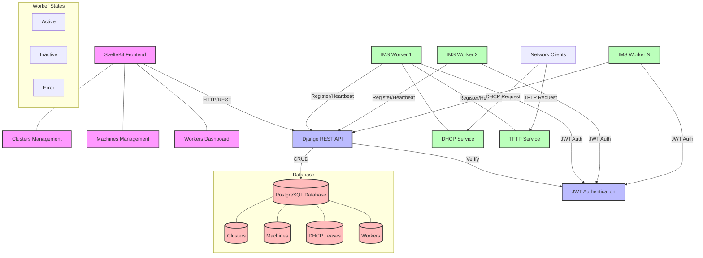
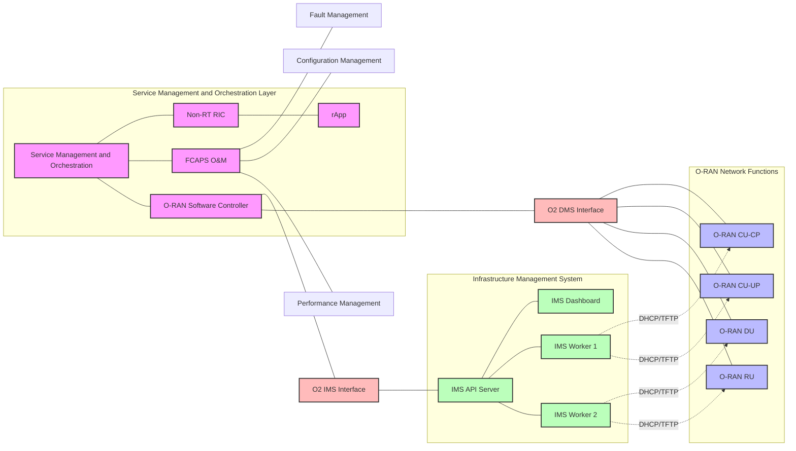
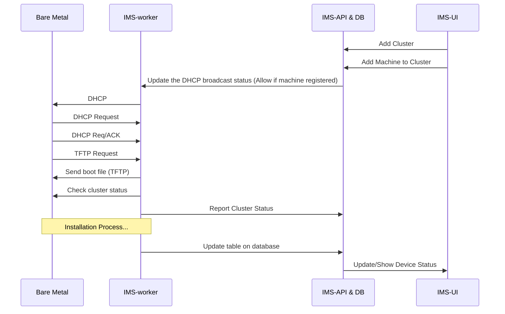
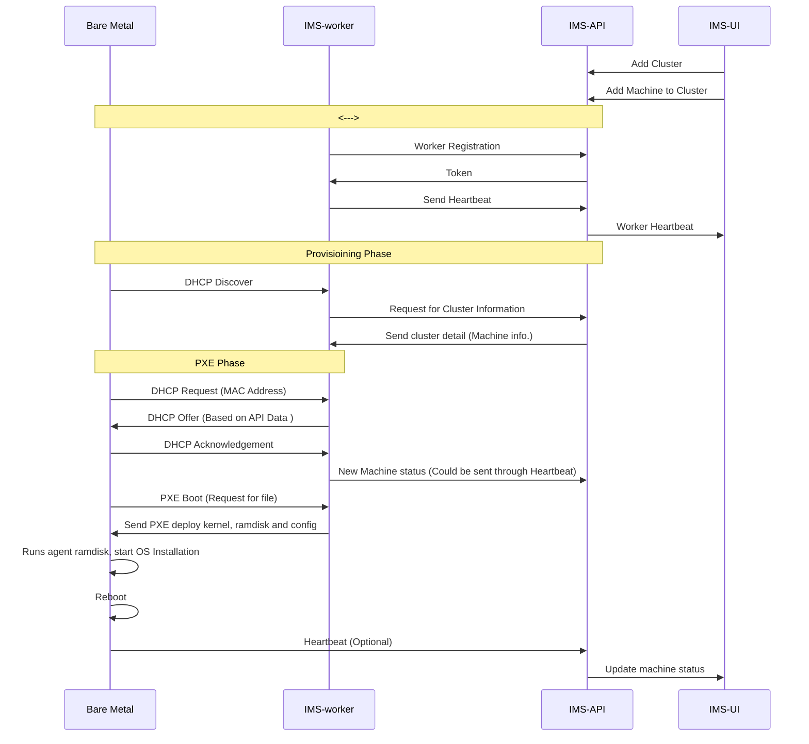
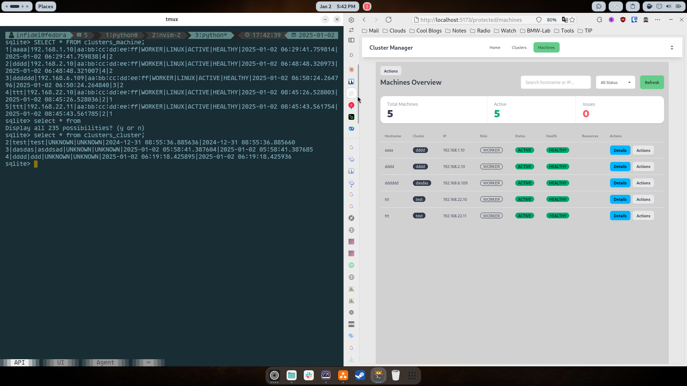
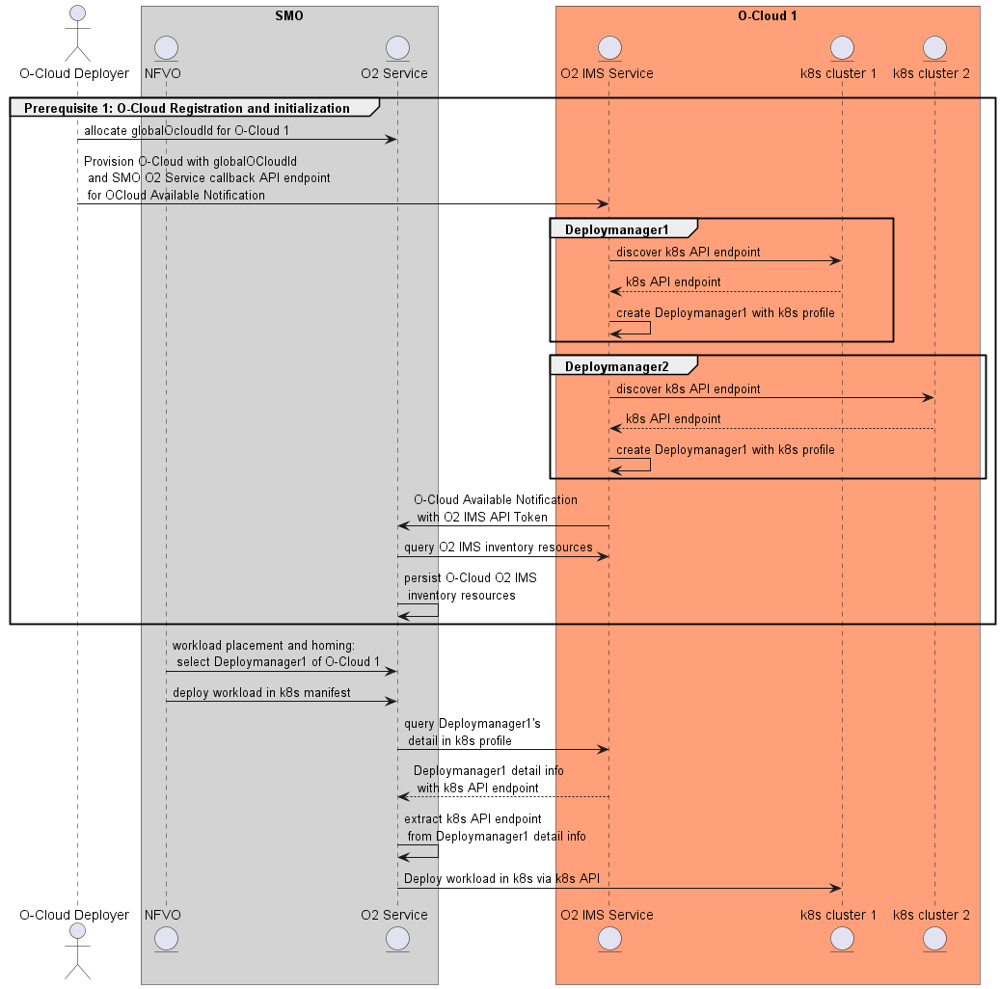

# O2 IMS: Implementation

```
Status: In progress
Created time: December 25, 2024 4:28 PM
Tag: K8S, O2, OSC
```


## Introduction

## Progress


> ⚠️ Will Migrate the logs from Outline soon…

> **Tracker**
> - [ ]  Create IMS agent module
> - [x]  DHCP Handler
> - [x]  Database connector
> - [x]  Define API call to be used
> - [x]  Create IMS API handler for FOCOM
>     - [x]  Salvage API from current OSC’s IMS proposal
>         - Take only the ones that is not useless
>     - [x]  Database connector between IMS-Worker  and IMS-API

### Implementation Topology





### Implementation Flow





### IMS-UI

- Need some way to allow admin to interacte with the IMS-Worker.
- IMS-UI will allow user to create cluster and add machines. This machines will be accepted by the IMS-Worker to perform netboot operation, thus starting the provisioning sequence.
    
    [Screencast From 2024-12-26 16-15-31.mp4](assets/Screencast_From_2024-12-26_16-15-31.mp4)
    
- Login Page for authentication purpose. The same token will also be applied towards IMS-Worker on the Edge side.
    
    [Screencast From 2024-12-30 17-32-55.mp4](assets/Screencast_From_2024-12-30_17-32-55.mp4)
    

### IMS-API

**Viewsets Definition**

| ViewSet  | Correspondent Function/Class  |
| --- | --- |
| IPPoolViewset | class IPPoolViewSet(viewsets.ModelViewSet): |
| LeaseViewset | class LeaseViewSet(viewsets.ModelViewSet): |
| DHCPConfigViewset | class DHCPConfigViewSet(viewsets.ModelViewSet): |
| TFTPConfigViewset | class TFTPConfigViewSet(viewsets.ModelViewSet): |

**API Definition**

| API | Context | Context | Status |
| --- | --- | --- | --- |
| **api/machines/** | POST,GET | View all machines | ✅ Implemented |
| **api/machines/{ID}** | POST,GET |  | ✅ Implemented |
| **api/cluster/** | GET | View all cluster | ✅ Implemented |
| **api/cluster/{ID}/add_machine** | POST | Add machine into cluster | ✅ Implemented |

# Database Schema

## Infrastructure Models

### Cluster
| Field | Type | Constraints | Description |
| --- | --- | --- | --- |
| id | Integer | Primary Key, Auto-increment |  |
| name | CharField | max_length=100 |  |
| description | TextField |  |  |
| status | CharField | max_length=20, choices | OPERATIONAL, DEGRADED, CRITICAL, MAINTENANCE, SCALING, UPGRADING, UNKNOWN |
| health | CharField | max_length=20, choices | HEALTHY, WARNING, CRITICAL, UNKNOWN |
| created_at | DateTimeField | auto_now_add=True |  |
| updated_at | DateTimeField | auto_now=True |  |

### Machine
| Field | Type | Constraints | Description |
| --- | --- | --- | --- |
| id | Integer | Primary Key, Auto-increment |  |
| cluster | ForeignKey | Cluster, CASCADE |  |
| hostname | CharField | max_length=100 |  |
| ip | GenericIPAddressField |  |  |
| mac | CharField | max_length=17 | Format: XX:XX:XX:XX:XX:XX |
| cpu_cores | IntegerField |  |  |
| role | CharField | max_length=20, choices | MASTER, WORKER, STORAGE, GATEWAY |
| os_type | CharField | max_length=20, choices | LINUX, WINDOWS, MACOS |
| status | CharField | max_length=20, choices | ACTIVE, INACTIVE, MAINTENANCE, ERROR, DEPLOYING, UPGRADING, UNREACHABLE |
| health | CharField | max_length=20, choices | HEALTHY, WARNING, CRITICAL, UNKNOWN |
| created_at | DateTimeField | auto_now_add=True |  |
| updated_at | DateTimeField | auto_now=True |  |

### ResourceMetrics
| Field | Type | Constraints | Description |
| --- | --- | --- | --- |
| id | Integer | Primary Key, Auto-increment |  |
| machine | OneToOneField | Machine, CASCADE |  |
| cpu_usage | FloatField |  |  |
| cpu_cores | IntegerField |  |  |
| memory_used | FloatField |  | In GB |
| memory_total | FloatField |  | In GB |
| memory_usage | FloatField |  | Percentage |
| disk_used | FloatField |  | In GB |
| disk_total | FloatField |  | In GB |
| disk_usage | FloatField |  | Percentage |
| network_incoming | FloatField |  | Mbps |
| network_outgoing | FloatField |  | Mbps |
| timestamp | DateTimeField | auto_now=True |  |

## DHCP & TFTP Models

### IPPool
| Field | Type | Constraints | Description |
| --- | --- | --- | --- |
| id | Integer | Primary Key, Auto-increment |  |
| cidr | CharField | max_length=18 | e.g., "192.168.1.0/24" |
| gateway | GenericIPAddressField |  |  |
| description | TextField | blank=True |  |
| created_at | DateTimeField | auto_now_add=True |  |
| updated_at | DateTimeField | auto_now=True |  |

### Lease
| Field | Type | Constraints | Description |
| --- | --- | --- | --- |
| id | Integer | Primary Key, Auto-increment |  |
| ip_address | GenericIPAddressField |  |  |
| mac_address | CharField | max_length=17 |  |
| hostname | CharField | max_length=255, blank=True |  |
| lease_start | DateTimeField |  |  |
| lease_end | DateTimeField |  |  |
| binding_state | CharField | max_length=20, choices | active, expired, released, abandoned |
| last_transaction | DateTimeField |  |  |
| next_binding_state | CharField | max_length=20, choices | active, expired, released, abandoned |
| bootfile_url | CharField | max_length=255, blank=True |  |
| tftp_server | GenericIPAddressField | blank=True, null=True |  |
| ip_pool | ForeignKey | IPPool, CASCADE |  |
| created_at | DateTimeField | auto_now_add=True |  |
| updated_at | DateTimeField | auto_now=True |  |

### DHCPConfig
| Field | Type | Constraints | Description |
| --- | --- | --- | --- |
| id | Integer | Primary Key, Auto-increment |  |
| enabled | BooleanField | default=True |  |
| mode | CharField | max_length=20, default='server' |  |
| bind_address | GenericIPAddressField | default='0.0.0.0' |  |
| bind_interface | CharField | max_length=50, blank=True |  |
| tftp_ip | GenericIPAddressField | blank=True, null=True |  |
| tftp_port | IntegerField | default=69 |  |
| created_at | DateTimeField | auto_now_add=True |  |
| updated_at | DateTimeField | auto_now=True |  |

### TFTPConfig
| Field | Type | Constraints | Description |
| --- | --- | --- | --- |
| id | Integer | Primary Key, Auto-increment |  |
| enabled | BooleanField | default=True |  |
| bind_address | GenericIPAddressField | default='0.0.0.0' |  |
| bind_port | IntegerField | default=69 |  |
| block_size | IntegerField | default=512 |  |
| root_directory | CharField | max_length=255, default='/var/lib/tftpboot' |  |
| created_at | DateTimeField | auto_now_add=True |  |
| updated_at | DateTimeField | auto_now=True |  |

## IMS Django Models

### IMSWorker

| Field | Type | Constraints | Description |
| --- | --- | --- | --- |
| id | Integer | Primary Key, Auto-increment |  |
| worker_id | CharField | max_length=100, unique=True | Could be container ID or hostname |
| ip_address | GenericIPAddressField |  |  |
| status | CharField | max_length=20, choices, default='inactive' | active, inactive, error |
| last_heartbeat | DateTimeField | auto_now=True |  |
| services | JSONField | default=dict | Stores DHCP/TFTP service status |
| metrics | JSONField | default=dict | Stores worker metrics |
| registered_at | DateTimeField | auto_now_add=True |  |
| cluster | ForeignKey | Cluster, SET_NULL, null=True, blank=True |  |

### IMSLease

| Field | Type | Constraints | Description |
| --- | --- | --- | --- |
| id | Integer | Primary Key, Auto-increment |  |
| ip_address | GenericIPAddressField |  |  |
| mac_address | CharField | max_length=17 |  |
| hostname | CharField | max_length=255, blank=True |  |
| lease_start | DateTimeField |  |  |
| lease_end | DateTimeField |  |  |
| worker | ForeignKey | IMSWorker, CASCADE |  |
| cidr | CharField | max_length=18 | e.g., "192.168.1.0/24" |
| gateway | GenericIPAddressField |  |  |
| status | CharField | max_length=20, default='active' |  |

> *Meta: unique_together = ['ip_address', 'mac_address']*
> 



- [x]  Integrate IMS-API rest authentication method with IMS-UI
    - This API will accommodate the authentication sequence that IMS-UI user and IMS-worker agent will use

**Current APIs**


- Define APIs
    - [x]  Authentication API
    - [ ]  IMS-Worker API
        
        Active API that will be used to perform IMS related jobs
        
    - [ ]  OSC PM/FM API
        
        Predefined API that OSC already standarized.
        

- Create place holder for topology mapping of deployed cluster on IMS-UI
    
    
    
- Add edit machine function to IMS-API backend, previously edit button from IMS-UI creating new machine instead of editing the existing one.
- Add proper service on IMS-UI to allow update of machine contents with dynamic path based on cluster ID and machine ID.
    - This way admin can edit which machine on which site using a single API call
        
        
        
    

### IMS Worker


- Integrate IMS-UI with IMS-API
    - Create API on IMS-API to allow machine information in database to be updated
- Add edit mechanism to machine list under a cluster section
- Implement Heartbeat on IMS-Worker
    - Heartbeats are the way for conccurent processes to signal life to outside parties, in our case IMS-Worker to IMS-API. This is needed to allow IMS-API to know about the realtime status of IMS related components such as DHCP, TFTP.
    - Need to decide whether IMS UI should get all of the realtime update from the site. This could lead to overload on the API and UI side.
    - 10s interval of self report


- Implement machine data fetching function on IMS-Worker through authenticated route. Allows IMS-Worker to serve only registered bare metals with registered Macaddress.
- ***Current integration phase***
    - ***Implementation Log:*** The IMS-UI and IMS-Worker are sharing the same sets of data now.

- Established contact to WindRVR guys if possible (They handle the Infra part of OSC)

**Authentication**

- *Skeleton Code*
    
    ```go
    // api/client.go
    package api
    
    import (
        "bytes"
        "encoding/json"
        "fmt"
        "net/http"
        "time"
        "sync"
    )
    
    type APIClient struct {
        baseURL     string
        workerID    string
        client      *http.Client
        authToken   string
        username    string
        password    string
        mu          sync.RWMutex
    }
    
    type AuthResponse struct {
        Access  string `json:"access"`
        Refresh string `json:"refresh"`
    }
    
    type WorkerStatus struct {
        Services map[string]ServiceStatus `json:"services"`
        Metrics  map[string]interface{}   `json:"metrics"`
    }
    
    type ServiceStatus struct {
        Status    string `json:"status"`
        LastError string `json:"last_error,omitempty"`
    }
    
    type LeaseInfo struct {
        IPAddress  string    `json:"ip_address"`
        MACAddress string    `json:"mac_address"`
        Hostname   string    `json:"hostname"`
        LeaseStart time.Time `json:"lease_start"`
        LeaseEnd   time.Time `json:"lease_end"`
        CIDR       string    `json:"cidr"`
        Gateway    string    `json:"gateway"`
    }
    
    func NewAPIClient(baseURL, workerID, username, password string) *APIClient {
        return &APIClient{
            baseURL:   baseURL,
            workerID:  workerID,
            username:  username,
            password:  password,
            client:    &http.Client{Timeout: 10 * time.Second},
        }
    }
    
    func (c *APIClient) login() error {
        data := map[string]string{
            "username": c.username,
            "password": c.password,
        }
    
        jsonData, err := json.Marshal(data)
        if err != nil {
            return fmt.Errorf("failed to marshal login data: %v", err)
        }
    
        resp, err := c.client.Post(
            c.baseURL+"/api/token/",
            "application/json",
            bytes.NewBuffer(jsonData),
        )
        if err != nil {
            return fmt.Errorf("login request failed: %v", err)
        }
        defer resp.Body.Close()
    
        if resp.StatusCode != http.StatusOK {
            return fmt.Errorf("login failed with status: %d", resp.StatusCode)
        }
    
        var authResp AuthResponse
        if err := json.NewDecoder(resp.Body).Decode(&authResp); err != nil {
            return fmt.Errorf("failed to decode auth response: %v", err)
        }
    
        c.mu.Lock()
        c.authToken = authResp.Access
        c.mu.Unlock()
    
        return nil
    }
    
    func (c *APIClient) getAuthHeader() string {
        c.mu.RLock()
        token := c.authToken
        c.mu.RUnlock()
        return "Bearer " + token
    }
    
    func (c *APIClient) doRequest(method, endpoint string, data interface{}) error {
        // Try request with current token
        err := c.doRequestWithAuth(method, endpoint, data)
        if err != nil && (err.Error() == "unauthorized" || err.Error() == "token expired") {
            // Try to login again
            if err := c.login(); err != nil {
                return fmt.Errorf("login retry failed: %v", err)
            }
            // Retry request with new token
            return c.doRequestWithAuth(method, endpoint, data)
        }
        return err
    }
    
    func (c *APIClient) doRequestWithAuth(method, endpoint string, data interface{}) error {
        jsonData, err := json.Marshal(data)
        if err != nil {
            return fmt.Errorf("failed to marshal data: %v", err)
        }
    
        req, err := http.NewRequest(
            method,
            c.baseURL+endpoint,
            bytes.NewBuffer(jsonData),
        )
        if err != nil {
            return fmt.Errorf("failed to create request: %v", err)
        }
    
        req.Header.Set("Content-Type", "application/json")
        req.Header.Set("Authorization", c.getAuthHeader())
    
        resp, err := c.client.Do(req)
        if err != nil {
            return fmt.Errorf("request failed: %v", err)
        }
        defer resp.Body.Close()
    
        if resp.StatusCode == http.StatusUnauthorized {
            return fmt.Errorf("unauthorized")
        }
    
        if resp.StatusCode != http.StatusOK {
            var errorResp map[string]interface{}
            if err := json.NewDecoder(resp.Body).Decode(&errorResp); err != nil {
                return fmt.Errorf("request failed with status %d", resp.StatusCode)
            }
            return fmt.Errorf("request failed: %v", errorResp)
        }
    
        return nil
    }
    
    func (c *APIClient) Register(ipAddress string) error {
        // First ensure we're logged in
        if err := c.login(); err != nil {
            return fmt.Errorf("initial login failed: %v", err)
        }
    
        data := map[string]string{
            "worker_id": c.workerID,
            "ip_address": ipAddress,
        }
    
        return c.doRequest("POST", "/api/ims-worker/register/", data)
    }
    
    func (c *APIClient) SendHeartbeat(status WorkerStatus) error {
        data := map[string]interface{}{
            "worker_id": c.workerID,
            "services": status.Services,
            "metrics": status.Metrics,
        }
    
        return c.doRequest("POST", "/api/ims-worker/heartbeat/", data)
    }
    
    func (c *APIClient) ReportLease(lease LeaseInfo) error {
        data := map[string]interface{}{
            "worker_id": c.workerID,
            "lease": lease,
        }
    
        return c.doRequest("POST", "/api/ims-worker/report_lease/", data)
    }
    
    func (c *APIClient) ReportError(message string, details map[string]interface{}) error {
        data := map[string]interface{}{
            "worker_id": c.workerID,
            "error": map[string]interface{}{
                "message": message,
                "details": details,
            },
        }
    
        return c.doRequest("POST", "/api/ims-worker/report_error/", data)
    }
    ```
    

**Authentication Sequence**


**TFTP Function**

> Import from Outline
> 

**DHCP Function**

> Import from Outline
> 

## Deployment Scenario

| **Components** | **Remarks** |
| --- | --- |
| Operating System |  |
| Hypervisor |  |
| Cloud Platform | - OpenShift
- K8S |
| RAN | OAI/OSC |
| Automation Tools | Ansible, Terraform, etc. |

| **OS** | **Hypervisor** | **Cloud Platform** | **RAN** |
| --- | --- | --- | --- |
| Ubuntu |  ***None***  | K8S | OAI/OSC |
| Ubuntu | KVM | K8S | OAI/OSC |
|  |  |  |  |

## Lesson Learned

<aside>
⚠️ *Lesson learned*

</aside>

### OSC Development Status

1. OSC haven’t decide on IMS implementation procedure
    1. WindRVR is the main contributor 
2. Need to wait NYCU confirmation regarding their type of implementation

### GO Related

**Heartbeat & GO Routine**

- Heartbeats are the way for conccurent processes to signal life to outside parties, in our case IMS-Worker to IMS-API. This is needed to allow IMS-API to know about the realtime status of IMS related components such as DHCP, TFTP.
    - Need to decide whether IMS UI should get all of the realtime update from the site. This could lead to overload on the API and UI side.
- Two different types of heartbeats
    - Occur at time interval
    - Occur at the beginning of a unit work
- Utilization of heartbeart on IMS
    - Update the IMS-UI status of created clusters
    - Log leased DHCP IP
    - …

### Django Related

## Study Reference

- **Milestone**: [https://lf-o-ran-sc.atlassian.net/wiki/spaces/IN/pages/14385176/INF+O2+IMS+and+DMS+Spec+Compliance](https://lf-o-ran-sc.atlassian.net/wiki/spaces/IN/pages/14385176/INF+O2+IMS+and+DMS+Spec+Compliance)
- **Release:** [https://lf-o-ran-sc.atlassian.net/wiki/spaces/REL/pages/12812923/K+Release#Infrastructure-(INF)](https://lf-o-ran-sc.atlassian.net/wiki/spaces/REL/pages/12812923/K+Release#Infrastructure-(INF))
- **Guideline:** [https://lf-o-ran-sc.atlassian.net/wiki/spaces/IN/pages/137035779/INF+Deployment+Guideline+-+StarlingX+O-Cloud+-+AIO+Simplex](https://lf-o-ran-sc.atlassian.net/wiki/spaces/IN/pages/137035779/INF+Deployment+Guideline+-+StarlingX+O-Cloud+-+AIO+Simplex)

### RedHat O2 IMS Module

[https://github.com/openshift-kni/oran-o2ims](https://github.com/openshift-kni/oran-o2ims)

> *KNI: Kubernetes-native Infrastructure*
> 

The ORAN O2 IMS implementation in OpenShift is managed by the IMS operator. It configures the different components defined in the specification: the deployment manager service, the resource server, alarm server, subscriptions to resource and alert.

The IMS operator will create an O-Cloud API that will be available to be queried, for instance from a SMO. It also provides a configuration mechanism using a Kubernetes custom resource definition (CRD) that allows the hub cluster administrator to configure the different IMS microservices properly.

### WindRVR O2 IMS Proposal

**WindRVR Demo Scenario (Replicable)**

- OKD auto deployment
    - Ansible based automatic deployment of
- Multi-Arch support of OCloud Deployment
- StarlingX O-Cloud based automatic deployment
- ETSI-DMS based implementation

**API Structure: Register**

```json
{

	"globalCloudId": "",
	"oCloudId": "",
	"IMS_EP": "https://...:30205",
	"smo_token_data": {
		"iss": "o2ims",
		"aud": "smo",
		"smo_token_payload": "xxx",
		"smo_token_type": "jwt",
		"smo_token_expiration": "",
		"smo_token_algo": "RS256"
	}
}
```

- Follow their defined data structure to be implemented on our IMS module

**WindRVR Proposed Flow**




Service API for O2 IMS is not defined yet

### NYCU O2 Implementation

> Ask Prof. for the PDF version of this
> 
> 
> [](https://thesis.lib.nycu.edu.tw/items/37ecdb53-9b4d-4ae3-bb85-614c3bd5701c)
> 

[NYCU O2 IMS Implementation Questions](https://www.notion.so/NYCU-O2-IMS-Implementation-Questions-175d924b024b80808dc4f61d0a6f4550?pvs=21)

| **Components** | **Context** | **Status on NYCU Implementation** |
| --- | --- | --- |
| **O2ims** |<ul><li>HTTP interface between SMO FOCOM and O-Cloud IMS</li> <li>Expose O-Cloud information to SMO</li></ul> | - Not shown any API call happened between SMO with IMS on the thesis report, implementation unclear. |
| **O2ims Provisioning API** | O2 Interface for Provisioning | <ul> <li>The shown IMS adaptor functions only cover the utilization of StarlingX in the Proxmox hypervisor. This doesn't cover other non-Proxmox deployments.</li><li>The implementation doesn't show any API calls being made between the IMS Core service and StarlingX adaptor, hence it is unclear whether there are any utilities.</li><li>The deployment of O-Cloud is performed using Ansible and has no correlation with any APIs that should manage the infrastructure creation.</li></ul> |
| O2ims Software Management Service |  | N/A, software used on the thesis is predefined by author |
| O2ims PM | Perfromance Monitoring |<ul><li>Defined by OSC, unclear it is used by NYCU implementation or not</li><li>Shown result can be completed without this component</li></ul> |
| O2ims  Inventory |  | <ul><li>Defined by OSC, unclear it is used by NYCU implementation or not<li>Shown result can be completed without this component </li></ul>|
| O2dms |  | All of the DMS components are done by OSM Mano and K8s. |


O-Cloud Deployment Scenario by NYCU


- Deployment are done by User the existence of API on the FOCOM side is questioned
- Initiate trigger that come into the FOCOM is unclear weather it is API called from somewhere (nobody knows where) or a user interaction.
- The AWX part of deployment shown no feedback is being given into FOCOM, hence the inventory and PM information is out of FOCOM’s vision as AWX had it’s own PM and Inventory System.

## Reports

### Presentation

[O2-Master-Thesis (1).pdf](assets/O2-Master-Thesis_(1).pdf)

### CallFlow HD

[BMW-Thesis-Call-Flow.pdf](assets/BMW-Thesis-Call-Flow.pdf)
